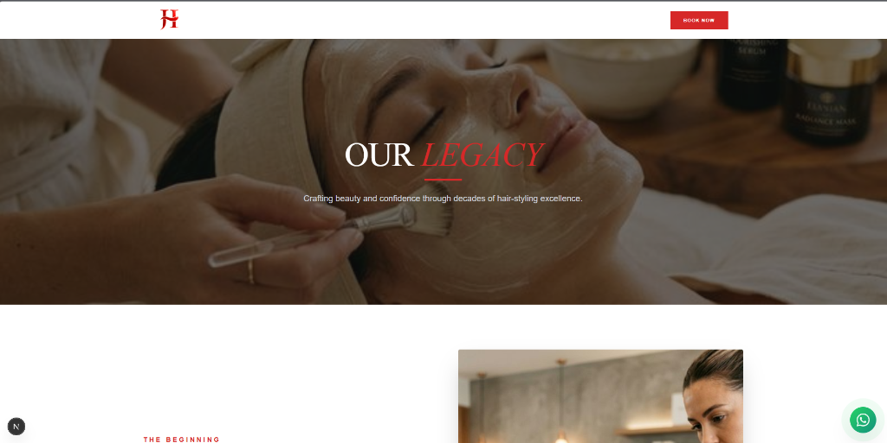
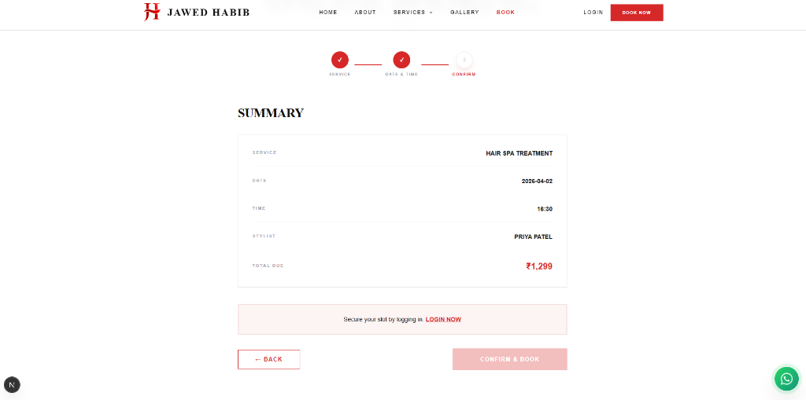

# 💆‍♂️ Jawed Habib • Salon Booking Fullstack Platform

[](https://opensource.org/licenses/MIT)
[](https://nextjs.org/)
[](https://tailwindcss.com/)
[](https://www.mongodb.com/atlas)

A modern, high-luxury full-stack salon management and booking platform built using the MERN + Next.js ecosystem. This application is inspired by the premium **Jawed Habib** heritage brand, delivering a seamless experience for both customers and administrators.

---

## 🚀 Live Demo
👉 **[Live on Vercel](https://salon-booking-fullstack-qm17.vercel.app/)** *(Link your deployed URL here)*

---

## ✨ Key Features

- **💎 Luxury Branding**: High-contrast, premium UI/UX with smooth Framer Motion animations.
- **📅 Smart Booking**: End-to-end appointment system with date/time slot validation and auto-advance logic.
- **🎨 Elite Portfolio Imagery**: Unique, high-definition visuals for 12+ service categories (Hair, Skin, Bridal, Grooming).
- **🙋 Audience Filtering**: Dynamic filtering for Men, Women, and Kids to find the perfect service instantly.
- **🔒 Secure Auth**: Full JWT-based authentication for both Users and Administrators.
- **🛠 Admin Command Center**: Dashboard for managing services, tracking analytics, and handling appointments.

---

## 🛠 Tech Stack

### Frontend
- **Framework**: Next.js 15 (App Router)
- **Styling**: Tailwind CSS & Framer Motion
- **Data Fetching**: TanStack Query (React Query)
- **State Management**: Context API

### Backend
- **Runtime**: Node.js & Express.js
- **Database**: MongoDB Atlas with Mongoose
- **Auth**: JSON Web Tokens (JWT) & Bcrypt

### Services
- **Imagery**: Cloudinary (Media Storage) & AI-Generated Premium Assets
- **Deployment**: Vercel (Frontend), Render (Backend)

---

## 📸 Screenshots

### 🏠 Homepage / Hero Section


### 📅 Booking Summary Page


---

## 📂 Project Structure

```text
salon-booking-fullstack/
├── salon-frontend/    # Next.js Application
├── salon-backend/     # Express API Server
└── screenshots/       # Documentation Assets
```

---

## ⚙️ Setup & Installation

### 1. Clone the Repository
```bash
git clone https://github.com/Adityakumar747/salon-booking-fullstack.git
cd salon-booking-fullstack
```

### 2. Backend Setup
```bash
cd salon-backend
npm install
```
Create a `.env` file and add:
```env
MONGODB_URI=your_mongodb_connection_string
JWT_SECRET=your_secret_key
# Optional: CLOUDINARY_URL=your_cloudinary_config
```
Run backend:
```bash
npm run dev
```

### 3. Frontend Setup
```bash
cd ../salon-frontend
npm install
```
Create `.env.local`:
```env
NEXT_PUBLIC_API_URL=http://localhost:5000/api/v1
```
Run frontend:
```bash
npm run dev
```

---

## 🌐 Deployment

| Component | Platform |
| :--- | :--- |
| **Frontend** | [Vercel](https://vercel.com) |
| **Backend** | [Render](https://render.com) / [Railway](https://railway.app) |
| **Database** | [MongoDB Atlas](https://www.mongodb.com/atlas) |

---

## 🤝 Contributing
*Developed for professional internship applications and recruitment showcases. 🚀*
Feel free to fork the repository and submit an issue or a pull request.

## 📄 License
This project is licensed under the MIT License.

## 👨‍💻 Author
**Aditya Kumar**
- GitHub: [@Adityakumar747](https://github.com/Adityakumar747)


